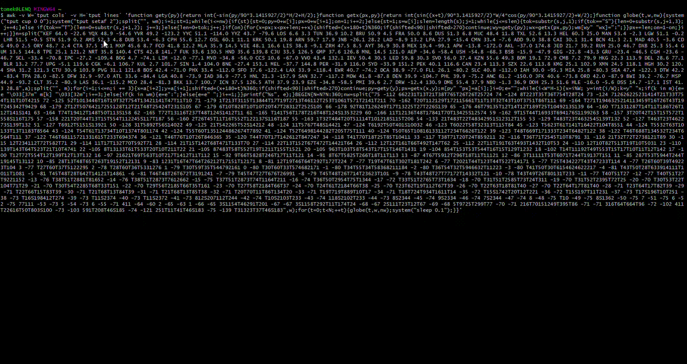

# console-world-map

World map of airports in your console with no dependencies!

## Purpose

Imagine you have only limited access to a Unix (Linux, MacOS, Git Bash) text console where you cannot easily transfer files and you have no personal directory for storage anyway. And you want to see the animated world map of the significant airports using just the command line `bash` and `awk`, without dependency on python etc. Now you can!

## Usage

There are two versions of the spinning globe provided as one line scripts to be pasted in Linux, MacOS or even Windows Git Bash command line.

[Country contours](globe_one_line.sh)

[Filled continents](globe_filled_one_line.sh)

For a simple contour Mercator map just copy and paste the contents of [this script](mercator_one_line.sh) into Linux (or compatible) command line.

Alternatively, use the unminified awk scripts in a file. Note that the parameters are needed to pass the exact window size.

```bash
awk -v W=`tput cols` -v H=`tput lines` -f globe.awk
```

```bash
awk -v W=`tput cols` -v H=`tput lines` -f globe_filled.awk
```

```bash
awk -v W=`tput cols` -v H=`tput lines` -f mercator_rle2.awk
```

### Example (spinning globe with country contours)


### Example (spinning globe with filled continents)



### Example (mercator projection)

```
::      :         :::::::::::::::::::   :::        :::              ::       :::::::::::::: :   :::: :::::::::: :
::::::::::::::::::::::::::::::::::::::::  ::    ::::::::        ::::::::::::::::::::::                 :      : :::::::
:::::::   ANC                :::::::::::  ::  :::   KEF:     ::OSL::HEL:::                                      :::  ::
    :::::::::::::           :::   :  :::    ::            :: :::CPH:::LED   KZN                           ::::::::::::
     :::       :::    YYC      ::::     ::               DUBSTN:TXL:::IEV   ::::::::::::    :::     :::  :::   ::::
                 :YVR::::::::::::   :::::YQX              ::ORYMUC:::::::: ::::::     ::::::: ::::::  :::::::
                  ::  SLC   MSP DTWJFK:::                :MAD:::FCO::IST::::::::::::::::  ::::::::PEK ::VVOCTS
                  :SFO   DEN     CLT:                   LIS:PMITUN:ATHAYT:::::::::::::             :::ICN:HND
                    SAN::: DFW ATL::                     CMN: ::::::::CAI: :    :::::::       CTU  :PVGFUK:
                     ::: :::IAH:MCO                   LPA:::   :  : ::::: :::DOH:::::DEL::::: KMG   TPE
       HNL            :::: :  ::::::                  ::::::  ::::: :::::JED:::::::::   :::::::::SZX:
        :                :MEX:::  :::::               ::  : ::   : ::   ::::::::   :BOM::::::::::: ::
                           ::::::  ::CCS              DSS::::::::  :  ::::::::      :BLR   ::BKK:  :MNL     GUM
                               :::::::::::             ::::::LOS::::::::ADD:::       :CMB   ::::  :::::
                                  :BOG::::::             ::::::::::::::::::::         :    ::KUL:::::::
                                 ::::::    :::::              ::::   :::NBO                  :::::::::::::::: ::
                                 : :: :         :              :LAD: :::::                    :CGK:UPG: ::::::::::
  APW                             LIM::::      :                :  ::::::: ::                       :::DRW ::::  :::
:                                  ::: :::  BSB:          HLE  :: :::::::::::                      :::   :::::     :
                                    ::::::: CGH                 : : ::::  :::                    :::         ::   ::
                       IPC          ::  :::::                   :::::JNB  ::                     ::           :BNE
                                    SCL EZE:                     ::::::                           PER::::::   SYD    :
                                   ::  :::                                                        ::     :::MEL      ::
                                   :: ::                                                                    ::      :::
                                   ::::                                           ::                               ::
                                   ::USH::
                                    :::
                                       :::
                                    ::::                      : :::   ::::::::::::::::::::::::::::::::::::::::::::
              :::::::::::::::::::::::: ::             ::::::::::::::::            :::                            ::::: 
```

## Data preparation

In order to modify the script you need to get the data sources. Just to make the task more challenging, all the data was prepared with shell and awk only, but of course you are able to use whatever you want.

### Airports location `airports.dat` 

[Description of the airport information](https://openflights.org/data.html)

[Airport information](https://raw.githubusercontent.com/jpatokal/openflights/master/data/airports.dat)

How to extract only the significant airports - use for example the list of the 100 largest airports and add significant airports that are located at extreme locations on each continent. Then replace the space separated list in the awk script.

Example:

```bash
cat airports.dat | awk -F, '$5 ~ /("ATL"|"PEK"|"LHR"|"ORD"|"HND"|"LAX"|"CDG"|"DFW"|"FRA"|"HKG"|"DEN"|"DXB"|"CGK"|"AMS"|"MAD"|"BKK"|"JFK"|"SIN"|"CAN"|"LAS"|"PVG"|"SFO"|"PHX"|"IAH"|"CLT"|"MIA"|"MUC"|"KUL"|"FCO"|"IST"|"SYD"|"MCO"|"ICN"|"DEL"|"BCN"|"LGW"|"EWR"|"YYZ"|"SHA"|"MSP"|"SEA"|"DTW"|"PHL"|"BOM"|"GRU"|"MNL"|"CTU"|"BOS"|"SZX"|"MEL"|"NRT"|"ORY"|"MEX"|"DME"|"AYT"|"TPE"|"ZRH"|"LGA"|"FLL"|"IAD"|"PMI"|"CPH"|"SVO"|"BWI"|"KMG"|"VIE"|"OSL"|"JED"|"BNE"|"SLC"|"DUS"|"BOG"|"MXP"|"JNB"|"ARN"|"MAN"|"MDW"|"DCA"|"BRU"|"DUB"|"GMP"|"DOH"|"STN"|"HGH"|"CJU"|"YVR"|"TXL"|"SAN"|"TPA"|"CGH"|"BSB"|"CTS"|"XMN"|"RUH"|"FUK"|"GIG"|"HEL"|"LIS"|"ATH"|"AKL"|"KRK"|"LED"|"CAI"|"AEP"|"EZE"|"MVD"|"LIM"|"USH"|"CCS"|"BSB"|"SCL"|"DSS"|"CMN"|"CTA"|"TUN"|"KEF"|"KZN"|"MLA"|"CMB"|"BLR"|"PER"|"UPG"|"VVO"|"LOS"|"ADD"|"NBO"|"LAD"|"YQX"|"HNL"|"IPC"|"GUM"|"IEV"|"APW"|"HLE"|"LPA"|"DRW"|"YYC"|"ANC")/ {printf("%s %.1f %.1f ",substr($5,2,3), $7, $8);}'
```

### World map `world-countries.json`

Just airports are cool but not enough, so you would like to have actual world map too. In fact someone already had [a similar idea](https://stackoverflow.com/questions/55406036/creating-an-ascii-art-world-map) to show the ASCII world map using python. Let's use the same source of [data](https://raw.githubusercontent.com/python-visualization/folium/master/examples/data/world-countries.json) but process it like it is 1977.

The json file contains polygons and to be precise you would need to find if the screen point fits into an interior of any each polygon. However with our low resolution and low tech approach we do not need to be so precise. Using awk I extracted the polygon vertices and rounded their coordinates to the closest degree, which results in very approximate country shapes adding up to continents. 

```bash
grep -o "[[][-0-9][-.0-9,]*" world-countries.json | cut -c 2- | awk -F, '{printf("%d %d\n",$2,$1)}' | sort --key=2,2 -n | sort -s -n | uniq | awk -f rle2.awk | tr "\n" " " > rle2.txt
```

First, I'm extracting the vertices, sort them by their numerical value and remove duplicates. Then to reduce the size of the script I employ a very simple run length encoding compression. The resulting string needs to be embedded in the awk script file or oneliner.

Creating the world map with filled continents basing on the nation boundaries requires more work. First, the json file is split into polygons and processed by an [awk file](find_interior.awk). For each point on the grid it is determined if it is inside any of the polygons. Then the same [run length encoding](rle2.awk) is used to generate the world map.

### Compatibility

In case of problems remove the escape strings used for color. 

## TODO

No dependency on command line parameters.


Copyright 2020 Tomasz Kwiatkowski


